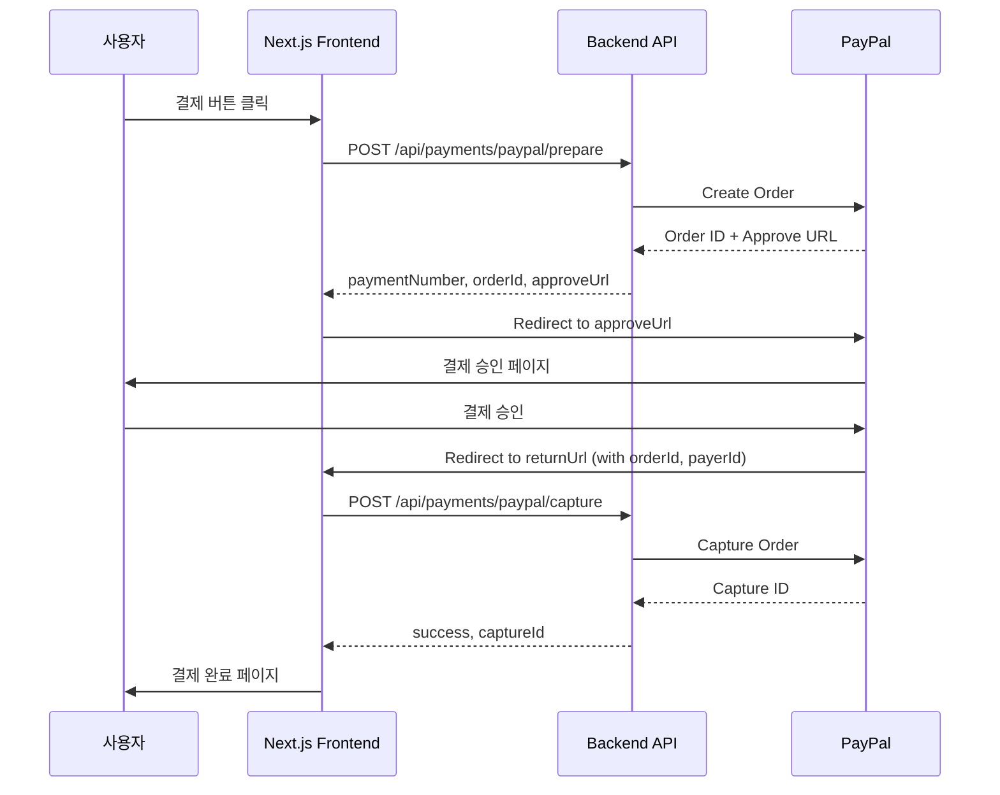
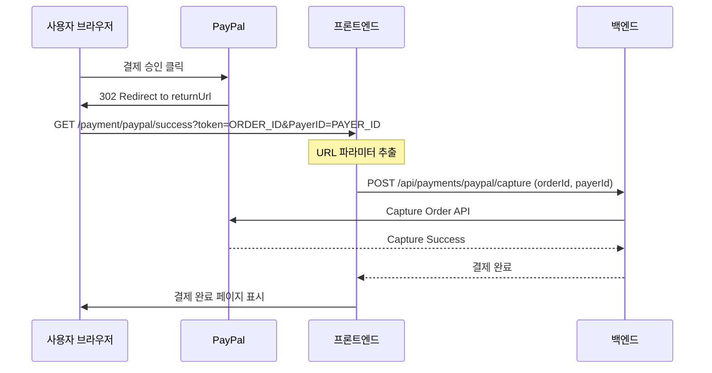
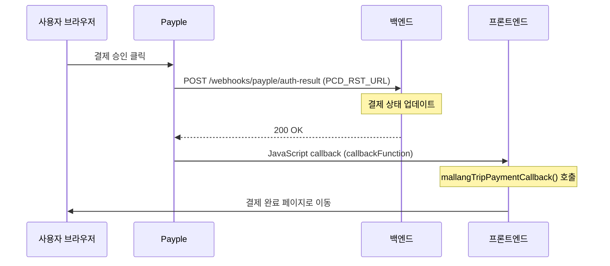

# PayPal 결제 프론트엔드 연동 가이드 (Next.js)

> 목적: Next.js 프론트엔드에서 PayPal 결제 연동하는 방법
> 작성일: 2025-10-08
> 대상: Frontend 개발자

---

## 📋 목차

1. [PayPal 결제 플로우](https://www.notion.so/PayPal-Next-js-286eff5e80e380389833fd6b73049741?pvs=21)
2. [API 엔드포인트](https://www.notion.so/PayPal-Next-js-286eff5e80e380389833fd6b73049741?pvs=21)
3. [결제 준비 (Prepare)](https://www.notion.so/PayPal-Next-js-286eff5e80e380389833fd6b73049741?pvs=21)
4. [결제 승인 (Capture)](https://www.notion.so/PayPal-Next-js-286eff5e80e380389833fd6b73049741?pvs=21)
5. [환불 (Refund)](https://www.notion.so/PayPal-Next-js-286eff5e80e380389833fd6b73049741?pvs=21)
6. [리턴 URL과 웹훅](https://www.notion.so/PayPal-Next-js-286eff5e80e380389833fd6b73049741?pvs=21)
7. [에러 처리](https://www.notion.so/PayPal-Next-js-286eff5e80e380389833fd6b73049741?pvs=21)
8. [전체 예제 코드](https://www.notion.so/PayPal-Next-js-286eff5e80e380389833fd6b73049741?pvs=21)

---

## 🔄 PayPal 결제 플로우



### 주요 단계

1. **결제 준비 (Prepare)**
   - 백엔드에 결제 정보 전송
   - PayPal Order 생성
   - `approveUrl` 발급
2. **PayPal 페이지 리디렉션**
   - 사용자를 PayPal 페이지로 이동
   - 사용자가 PayPal에서 결제 승인
3. **Return URL 처리**
   - PayPal에서 `returnUrl`로 리디렉션
   - 쿼리 파라미터: `token` (orderId), `PayerID` (payerId)
4. **결제 캡처 (Capture)**
   - 백엔드에 캡처 요청
   - 실제 결제 완료 처리

---

## 🌐 API 엔드포인트

### Base URL

```
Production: <https://v2.mallangtrip-server.com/api>
Development: <http://localhost:8080>

```

### 인증

모든 API는 JWT 토큰 필요 (환불 제외 일부 API):

```tsx
headers: {
  'Authorization': `Bearer ${accessToken}`,
  'Content-Type': 'application/json'
}

```

---

## 💳 결제 준비 (Prepare)

### API 명세

**Endpoint**: `POST /api/payments/paypal/prepare`

**Headers**:

```tsx
{
  'Authorization': 'Bearer <JWT_TOKEN>',
  'Content-Type': 'application/json'
}

```

**Request Body**:

```tsx
interface PreparePayPalPaymentRequest {
  productName: string; // 상품명 (필수)
  payerName: string; // 결제자명 (필수, 2-50자)
  payerEmail?: string; // 결제자 이메일
  payerPhone: string; // 결제자 전화번호 (국제 표준 E.164 형식, 예: +821012345678)
  amount: number; // 결제 금액 (필수, 최소 1)
  currency: string; // 통화 코드 (기본: USD)
  productDescription?: string; // 상품 설명
  memo?: string; // 메모
  returnUrl?: string; // 성공 리턴 URL
  cancelUrl?: string; // 취소 리턴 URL
}
```

**전화번호 형식 규칙**:

- **필수**: 국제 표준 E.164 형식 (`+[국가번호][전화번호]`)
- **형식**: `^\\\\+[1-9][0-9]{0,2}[0-9]{4,14}$`
- **예시**:
  - 한국: `+821012345678` (+82 + 10자리)
  - 미국: `+14155552671` (+1 + 10자리)
  - 일본: `+819012345678` (+81 + 10-11자리)
  - 중국: `+8613812345678` (+86 + 11자리)
  - 영국: `+447700900123` (+44 + 10자리)

**Response**:

```tsx
interface PreparePayPalPaymentResponse {
  success: boolean;
  data: {
    success: boolean;
    paymentNumber: string; // 결제번호 (PAY_20250106_001)
    orderId: string; // PayPal Order ID
    approveUrl: string; // 결제 승인 URL (사용자 리디렉션용)
    amount: number; // 결제 금액
    currency: string; // 통화 코드
    message: string; // 응답 메시지
  };
  message: string;
  timestamp: string;
}
```

### Next.js 예제 코드

### 1. API Route Handler (App Router)

`app/api/payments/paypal/prepare/route.ts`:

```tsx
import { NextRequest, NextResponse } from "next/server";

interface PreparePaymentRequest {
  productName: string;
  payerName: string;
  payerEmail?: string;
  payerPhone: string;
  amount: number;
  currency: string;
  returnUrl?: string;
  cancelUrl?: string;
}

export async function POST(request: NextRequest) {
  try {
    const body: PreparePaymentRequest = await request.json();

    // JWT 토큰 가져오기 (쿠키 또는 헤더에서)
    const token = request.cookies.get("accessToken")?.value;

    if (!token) {
      return NextResponse.json({ error: "Unauthorized" }, { status: 401 });
    }

    // 백엔드 API 호출
    const response = await fetch(
      `${process.env.NEXT_PUBLIC_API_URL}/api/payments/paypal/prepare`,
      {
        method: "POST",
        headers: {
          Authorization: `Bearer ${token}`,
          "Content-Type": "application/json",
        },
        body: JSON.stringify({
          ...body,
          returnUrl:
            body.returnUrl ||
            `${process.env.NEXT_PUBLIC_BASE_URL}/payment/paypal/success`,
          cancelUrl:
            body.cancelUrl ||
            `${process.env.NEXT_PUBLIC_BASE_URL}/payment/paypal/cancel`,
        }),
      },
    );

    if (!response.ok) {
      const error = await response.json();
      return NextResponse.json(
        { error: error.message || "Payment preparation failed" },
        { status: response.status },
      );
    }

    const data = await response.json();
    return NextResponse.json(data);
  } catch (error) {
    console.error("PayPal prepare error:", error);
    return NextResponse.json(
      { error: "Internal server error" },
      { status: 500 },
    );
  }
}
```

### 2. Client Component (결제 버튼)

`components/PayPalPaymentButton.tsx`:

```tsx
"use client";

import { useState } from "react";
import { useRouter } from "next/navigation";

interface PayPalPaymentButtonProps {
  productName: string;
  amount: number;
  currency?: string;
  payerName: string;
  payerEmail: string;
  payerPhone: string;
}

export default function PayPalPaymentButton({
  productName,
  amount,
  currency = "USD",
  payerName,
  payerEmail,
  payerPhone,
}: PayPalPaymentButtonProps) {
  const router = useRouter();
  const [loading, setLoading] = useState(false);
  const [error, setError] = useState<string | null>(null);

  const handlePayment = async () => {
    setLoading(true);
    setError(null);

    try {
      // 1. 결제 준비 API 호출
      const response = await fetch("/api/payments/paypal/prepare", {
        method: "POST",
        headers: {
          "Content-Type": "application/json",
        },
        body: JSON.stringify({
          productName,
          amount,
          currency,
          payerName,
          payerEmail,
          payerPhone,
        }),
      });

      if (!response.ok) {
        const error = await response.json();
        throw new Error(error.error || "Failed to prepare payment");
      }

      const result = await response.json();

      // 2. 결제번호 저장 (캡처 시 필요)
      if (typeof window !== "undefined") {
        sessionStorage.setItem(
          "paypalPaymentNumber",
          result.data.paymentNumber,
        );
      }

      // 3. PayPal 승인 페이지로 리디렉션
      if (result.data.approveUrl) {
        window.location.href = result.data.approveUrl;
      } else {
        throw new Error("Approve URL not found");
      }
    } catch (err) {
      console.error("Payment error:", err);
      setError(err instanceof Error ? err.message : "Payment failed");
      setLoading(false);
    }
  };

  return (
    <div className="space-y-4">
      <button
        onClick={handlePayment}
        disabled={loading}
        className="flex w-full items-center justify-center rounded-lg bg-blue-600 px-6 py-3 font-semibold text-white transition duration-200 hover:bg-blue-700 disabled:bg-gray-400"
      >
        {loading ? (
          <>
            <svg
              className="-ml-1 mr-3 h-5 w-5 animate-spin text-white"
              xmlns="<http://www.w3.org/2000/svg>"
              fill="none"
              viewBox="0 0 24 24"
            >
              <circle
                className="opacity-25"
                cx="12"
                cy="12"
                r="10"
                stroke="currentColor"
                strokeWidth="4"
              ></circle>
              <path
                className="opacity-75"
                fill="currentColor"
                d="M4 12a8 8 0 018-8V0C5.373 0 0 5.373 0 12h4zm2 5.291A7.962 7.962 0 014 12H0c0 3.042 1.135 5.824 3 7.938l3-2.647z"
              ></path>
            </svg>
            Processing...
          </>
        ) : (
          <>
            <svg
              className="mr-2 h-5 w-5"
              fill="currentColor"
              viewBox="0 0 24 24"
            >
              <path d="M7.076 21.337H2.47a.641.641 0 0 1-.633-.74L4.944.901C5.026.382 5.474 0 5.998 0h7.46c2.57 0 4.578.543 5.69 1.81 1.01 1.15 1.304 2.42 1.012 4.287-.023.143-.047.288-.077.437-.983 5.05-4.349 6.797-8.647 6.797h-2.19c-.524 0-.968.382-1.05.9l-1.12 7.106zm14.146-14.42a3.35 3.35 0 0 0-.607-.541c-.013.076-.026.175-.041.254-.93 4.778-4.005 7.201-9.138 7.201h-2.19a.563.563 0 0 0-.556.479l-1.187 7.527h-.506c-.41 0-.674-.316-.607-.662l.506-3.197c.082-.518.526-.9 1.05-.9h1.506c5.753 0 9.159-2.223 10.296-8.845.097-.562.137-1.041.137-1.449 0-.158-.013-.301-.041-.437a3.35 3.35 0 0 0-.607-.541z" />
            </svg>
            Pay with PayPal
          </>
        )}
      </button>

      {error && (
        <div className="rounded-lg border border-red-200 bg-red-50 p-4">
          <p className="text-sm text-red-600">{error}</p>
        </div>
      )}

      <div className="text-center text-xs text-gray-500">
        You will be redirected to PayPal to complete your payment
      </div>
    </div>
  );
}
```

### 3. 결제 페이지 예제

`app/payment/page.tsx`:

```tsx
import PayPalPaymentButton from "@/components/PayPalPaymentButton";

export default function PaymentPage() {
  // 실제로는 서버에서 데이터를 가져오거나 props로 전달받음
  const paymentInfo = {
    productName: "Jeju Island Tour Package",
    amount: 10000, // 센트 단위 (USD $100.00)
    currency: "USD",
    payerName: "John Doe",
    payerEmail: "john@example.com",
    payerPhone: "+821012345678",
  };

  return (
    <div className="mx-auto max-w-md p-6">
      <h1 className="mb-6 text-2xl font-bold">Complete Your Payment</h1>

      <div className="mb-6 rounded-lg bg-white p-6 shadow-md">
        <h2 className="mb-4 text-lg font-semibold">Order Summary</h2>
        <div className="space-y-2 text-sm">
          <div className="flex justify-between">
            <span className="text-gray-600">Product:</span>
            <span className="font-medium">{paymentInfo.productName}</span>
          </div>
          <div className="flex justify-between">
            <span className="text-gray-600">Amount:</span>
            <span className="font-medium">
              {paymentInfo.currency} ${(paymentInfo.amount / 100).toFixed(2)}
            </span>
          </div>
        </div>
      </div>

      <PayPalPaymentButton {...paymentInfo} />
    </div>
  );
}
```

---

## ✅ 결제 승인 (Capture)

### API 명세

**Endpoint**: `POST /api/payments/paypal/capture`

**Headers**:

```tsx
{
  'Content-Type': 'application/json'
}

```

**Request Body**:

```tsx
interface CapturePayPalPaymentRequest {
  orderId: string; // PayPal Order ID (필수)
  payerId?: string; // PayPal Payer ID (선택)
  paymentNumber?: string; // 결제번호 (선택, prepare 응답의 paymentNumber)
}
```

**Response**:

```tsx
interface CapturePayPalPaymentResponse {
  success: boolean;
  data: {
    success: boolean;
    paymentNumber: string; // 결제번호
    captureId: string; // PayPal Capture ID
    amount: number; // 결제 금액
    currency: string; // 통화 코드
    capturedAt: string; // 캡처 일시
    payerEmail?: string; // 결제자 이메일
    message: string; // 응답 메시지
  };
  message: string;
  timestamp: string;
}
```

### Next.js 예제 코드

### 1. API Route Handler

`app/api/payments/paypal/capture/route.ts`:

```tsx
import { NextRequest, NextResponse } from "next/server";

interface CapturePaymentRequest {
  orderId: string;
  payerId?: string;
  paymentNumber?: string;
}

export async function POST(request: NextRequest) {
  try {
    const body: CapturePaymentRequest = await request.json();

    // 백엔드 API 호출 (JWT 토큰 없이도 가능)
    const response = await fetch(
      `${process.env.NEXT_PUBLIC_API_URL}/api/payments/paypal/capture`,
      {
        method: "POST",
        headers: {
          "Content-Type": "application/json",
        },
        body: JSON.stringify(body),
      },
    );

    if (!response.ok) {
      const error = await response.json();
      return NextResponse.json(
        { error: error.message || "Payment capture failed" },
        { status: response.status },
      );
    }

    const data = await response.json();
    return NextResponse.json(data);
  } catch (error) {
    console.error("PayPal capture error:", error);
    return NextResponse.json(
      { error: "Internal server error" },
      { status: 500 },
    );
  }
}
```

### 2. Success Page (Return URL 처리)

`app/payment/paypal/success/page.tsx`:

```tsx
"use client";

import { useEffect, useState } from "react";
import { useSearchParams, useRouter } from "next/navigation";

export default function PayPalSuccessPage() {
  const searchParams = useSearchParams();
  const router = useRouter();
  const [status, setStatus] = useState<"processing" | "success" | "error">(
    "processing",
  );
  const [result, setResult] = useState<any>(null);
  const [error, setError] = useState<string | null>(null);

  useEffect(() => {
    const capturePayment = async () => {
      try {
        // 1. URL에서 PayPal 파라미터 추출
        const orderId = searchParams.get("token"); // PayPal은 token으로 반환
        const payerId = searchParams.get("PayerID");

        if (!orderId) {
          throw new Error("Order ID not found in URL");
        }

        // 2. 저장된 결제번호 가져오기
        const paymentNumber = sessionStorage.getItem("paypalPaymentNumber");

        // 3. 캡처 API 호출
        const response = await fetch("/api/payments/paypal/capture", {
          method: "POST",
          headers: {
            "Content-Type": "application/json",
          },
          body: JSON.stringify({
            orderId,
            payerId,
            paymentNumber,
          }),
        });

        if (!response.ok) {
          const error = await response.json();
          throw new Error(error.error || "Capture failed");
        }

        const data = await response.json();
        setResult(data.data);
        setStatus("success");

        // 4. 저장된 결제번호 삭제
        sessionStorage.removeItem("paypalPaymentNumber");

        // 5. 3초 후 주문 완료 페이지로 리디렉션
        setTimeout(() => {
          router.push(`/orders/${data.data.paymentNumber}`);
        }, 3000);
      } catch (err) {
        console.error("Capture error:", err);
        setError(err instanceof Error ? err.message : "Payment capture failed");
        setStatus("error");
      }
    };

    capturePayment();
  }, [searchParams, router]);

  if (status === "processing") {
    return (
      <div className="flex min-h-screen items-center justify-center bg-gray-50">
        <div className="text-center">
          <div className="mb-4 inline-block h-12 w-12 animate-spin rounded-full border-b-2 border-blue-600"></div>
          <h2 className="text-xl font-semibold text-gray-700">
            Processing your payment...
          </h2>
          <p className="mt-2 text-gray-500">
            Please wait while we confirm your payment.
          </p>
        </div>
      </div>
    );
  }

  if (status === "error") {
    return (
      <div className="flex min-h-screen items-center justify-center bg-gray-50">
        <div className="max-w-md rounded-lg bg-white p-8 shadow-lg">
          <div className="text-center">
            <svg
              className="mx-auto h-12 w-12 text-red-500"
              fill="none"
              stroke="currentColor"
              viewBox="0 0 24 24"
            >
              <path
                strokeLinecap="round"
                strokeLinejoin="round"
                strokeWidth={2}
                d="M6 18L18 6M6 6l12 12"
              />
            </svg>
            <h2 className="mt-4 text-2xl font-bold text-gray-800">
              Payment Failed
            </h2>
            <p className="mt-2 text-gray-600">{error}</p>
            <button
              onClick={() => router.push("/payment")}
              className="mt-6 w-full rounded-lg bg-blue-600 px-4 py-2 font-semibold text-white hover:bg-blue-700"
            >
              Try Again
            </button>
          </div>
        </div>
      </div>
    );
  }

  return (
    <div className="flex min-h-screen items-center justify-center bg-gray-50">
      <div className="max-w-md rounded-lg bg-white p-8 shadow-lg">
        <div className="text-center">
          <svg
            className="mx-auto h-12 w-12 text-green-500"
            fill="none"
            stroke="currentColor"
            viewBox="0 0 24 24"
          >
            <path
              strokeLinecap="round"
              strokeLinejoin="round"
              strokeWidth={2}
              d="M5 13l4 4L19 7"
            />
          </svg>
          <h2 className="mt-4 text-2xl font-bold text-gray-800">
            Payment Successful!
          </h2>
          <p className="mt-2 text-gray-600">
            Your payment has been processed successfully.
          </p>

          {result && (
            <div className="mt-6 rounded-lg bg-gray-50 p-4 text-left">
              <div className="space-y-2 text-sm">
                <div className="flex justify-between">
                  <span className="text-gray-600">Payment Number:</span>
                  <span className="font-medium">{result.paymentNumber}</span>
                </div>
                <div className="flex justify-between">
                  <span className="text-gray-600">Amount:</span>
                  <span className="font-medium">
                    {result.currency} ${(result.amount / 100).toFixed(2)}
                  </span>
                </div>
                <div className="flex justify-between">
                  <span className="text-gray-600">Capture ID:</span>
                  <span className="font-mono text-xs">{result.captureId}</span>
                </div>
              </div>
            </div>
          )}

          <p className="mt-4 text-sm text-gray-500">
            Redirecting to order details...
          </p>
        </div>
      </div>
    </div>
  );
}
```

### 3. Cancel Page

`app/payment/paypal/cancel/page.tsx`:

```tsx
"use client";

import { useRouter } from "next/navigation";
import { useEffect } from "react";

export default function PayPalCancelPage() {
  const router = useRouter();

  useEffect(() => {
    // 저장된 결제번호 삭제
    sessionStorage.removeItem("paypalPaymentNumber");
  }, []);

  return (
    <div className="flex min-h-screen items-center justify-center bg-gray-50">
      <div className="max-w-md rounded-lg bg-white p-8 shadow-lg">
        <div className="text-center">
          <svg
            className="mx-auto h-12 w-12 text-yellow-500"
            fill="none"
            stroke="currentColor"
            viewBox="0 0 24 24"
          >
            <path
              strokeLinecap="round"
              strokeLinejoin="round"
              strokeWidth={2}
              d="M12 9v2m0 4h.01m-6.938 4h13.856c1.54 0 2.502-1.667 1.732-3L13.732 4c-.77-1.333-2.694-1.333-3.464 0L3.34 16c-.77 1.333.192 3 1.732 3z"
            />
          </svg>
          <h2 className="mt-4 text-2xl font-bold text-gray-800">
            Payment Cancelled
          </h2>
          <p className="mt-2 text-gray-600">
            You have cancelled the PayPal payment.
          </p>

          <button
            onClick={() => router.push("/payment")}
            className="mt-6 w-full rounded-lg bg-blue-600 px-4 py-2 font-semibold text-white hover:bg-blue-700"
          >
            Try Again
          </button>
        </div>
      </div>
    </div>
  );
}
```

---

## 💸 환불 (Refund)

### API 명세

**Endpoint**: `POST /api/payments/paypal/{paymentNumber}/refund`

**Request Body**:

```tsx
interface RefundPayPalPaymentRequest {
  refundReason: string; // 환불 사유 (필수, 1-200자)
  refundAmount?: number; // 환불 금액 (선택, 미입력 시 전체 환불)
  currency?: string; // 통화 코드
}
```

**Response**:

```tsx
interface RefundPayPalPaymentResponse {
  success: boolean;
  data: {
    success: boolean;
    paymentNumber: string;
    refundId: string; // PayPal Refund ID
    refundAmount: number;
    currency: string;
    refundedAt: string;
    message: string;
  };
  message: string;
  timestamp: string;
}
```

### Next.js 예제 코드

```tsx
"use client";

import { useState } from "react";

interface RefundButtonProps {
  paymentNumber: string;
  maxRefundAmount: number;
  currency: string;
}

export default function RefundButton({
  paymentNumber,
  maxRefundAmount,
  currency,
}: RefundButtonProps) {
  const [loading, setLoading] = useState(false);
  const [refundAmount, setRefundAmount] = useState<number>(maxRefundAmount);
  const [refundReason, setRefundReason] = useState("");
  const [error, setError] = useState<string | null>(null);
  const [success, setSuccess] = useState(false);

  const handleRefund = async () => {
    if (!refundReason.trim()) {
      setError("Please provide a refund reason");
      return;
    }

    setLoading(true);
    setError(null);

    try {
      const response = await fetch(
        `/api/payments/paypal/${paymentNumber}/refund`,
        {
          method: "POST",
          headers: {
            "Content-Type": "application/json",
          },
          body: JSON.stringify({
            refundReason,
            refundAmount:
              refundAmount === maxRefundAmount ? undefined : refundAmount,
            currency,
          }),
        },
      );

      if (!response.ok) {
        const error = await response.json();
        throw new Error(error.error || "Refund failed");
      }

      const result = await response.json();
      setSuccess(true);
    } catch (err) {
      console.error("Refund error:", err);
      setError(err instanceof Error ? err.message : "Refund failed");
    } finally {
      setLoading(false);
    }
  };

  if (success) {
    return (
      <div className="rounded-lg border border-green-200 bg-green-50 p-4">
        <p className="text-green-600">Refund processed successfully!</p>
      </div>
    );
  }

  return (
    <div className="space-y-4">
      <div>
        <label className="mb-2 block text-sm font-medium text-gray-700">
          Refund Amount ({currency})
        </label>
        <input
          type="number"
          value={refundAmount}
          max={maxRefundAmount}
          onChange={(e) => setRefundAmount(Number(e.target.value))}
          className="w-full rounded-lg border border-gray-300 px-3 py-2 focus:border-blue-500 focus:ring-blue-500"
        />
        <p className="mt-1 text-xs text-gray-500">
          Max: ${(maxRefundAmount / 100).toFixed(2)}
        </p>
      </div>

      <div>
        <label className="mb-2 block text-sm font-medium text-gray-700">
          Refund Reason
        </label>
        <textarea
          value={refundReason}
          onChange={(e) => setRefundReason(e.target.value)}
          maxLength={200}
          rows={3}
          className="w-full rounded-lg border border-gray-300 px-3 py-2 focus:border-blue-500 focus:ring-blue-500"
          placeholder="Enter refund reason..."
        />
      </div>

      {error && (
        <div className="rounded-lg border border-red-200 bg-red-50 p-4">
          <p className="text-sm text-red-600">{error}</p>
        </div>
      )}

      <button
        onClick={handleRefund}
        disabled={loading}
        className="w-full rounded-lg bg-red-600 px-4 py-2 font-semibold text-white hover:bg-red-700 disabled:bg-gray-400"
      >
        {loading ? "Processing..." : "Process Refund"}
      </button>
    </div>
  );
}
```

---

## 🔄 리턴 URL과 웹훅

### returnUrl과 cancelUrl의 의미

결제 준비 시 지정하는 `returnUrl`과 `cancelUrl`은 **PG사마다 다른 의미**를 가집니다.

---

### 1️⃣ PayPal - 프론트엔드 리디렉션 URL

```tsx
{
  returnUrl: "<https://mallangtrip.com/payment/paypal/success>",
  cancelUrl: "<https://mallangtrip.com/payment/paypal/cancel>"
}

```

**의미**:

- ✅ **프론트엔드 페이지 URL** (사용자가 보는 페이지)
- ✅ 사용자가 PayPal에서 결제 승인/취소 후 **브라우저로 리디렉션**되는 URL
- ❌ 웹훅 URL이 **아님**

**플로우**:



**특징**:

- URL 파라미터로 `token` (orderId), `PayerID` (payerId) 전달
- 프론트엔드에서 **capture API를 호출해야 실제 결제 완료됨**
- ⚠️ 사용자가 브라우저를 닫으면 capture가 누락될 수 있음 (웹훅으로 보완 필요)

**예시**:

```
성공 URL: <https://mallangtrip.com/payment/paypal/success?token=5O190127TN364715T&PayerID=ABCD1234EFGH>
취소 URL: <https://mallangtrip.com/payment/paypal/cancel>

```

---

### 2️⃣ Payple - 백엔드 웹훅 콜백 URL

```kotlin
// 백엔드 코드 예시
PCD_RST_URL = "<https://v2.mallangtrip-server.com/api/payments/webhooks/payple/auth-result>"

```

**의미**:

- ✅ **백엔드 API 엔드포인트** (서버 간 통신)
- ✅ Payple이 결제 결과를 **POST로 전송**하는 웹훅 URL
- ❌ 사용자가 직접 방문하는 페이지 **아님**

**플로우**:



**특징**:

- Payple이 **서버로 직접** POST 요청을 전송
- 프론트엔드는 `callbackFunction`으로 별도 처리
- ✅ 사용자 브라우저와 무관하게 결제 결과 수신 가능

---

### 📡 웹훅(Webhook)이란?

**웹훅 = 서버 간 비동기 알림**

특정 이벤트가 발생했을 때 PG사가 **우리 서버로** HTTP 요청을 보내는 방식입니다.

### PayPal 웹훅 (별도 설정 필요)

**설정 위치**: PayPal Developer Dashboard → Webhooks

**웹훅 URL**:

```
<https://v2.mallangtrip-server.com/api/payments/webhooks/paypal>

```

**목적**:

- 결제 완료, 환불, 분쟁 등 다양한 이벤트 수신
- 사용자가 브라우저를 닫아도 결제 상태 동기화
- returnUrl 방식의 한계 보완

**수신 이벤트 예시**:

```json
{
  "event_type": "PAYMENT.CAPTURE.COMPLETED",
  "resource": {
    "id": "CAPTURE_ID",
    "status": "COMPLETED",
    "amount": {
      "value": "100.00",
      "currency_code": "USD"
    }
  }
}
```

**주요 이벤트 타입**:

- `PAYMENT.CAPTURE.COMPLETED` - 결제 완료
- `PAYMENT.CAPTURE.REFUNDED` - 환불 완료
- `PAYMENT.CAPTURE.DENIED` - 결제 거절

### Payple 웹훅 (PCD_RST_URL이 웹훅 역할)

- Payple은 **returnUrl 자체가 웹훅**
- 별도 웹훅 설정 불필요
- `PCD_RST_URL`로 결제 결과 POST 전송

---

### 📊 PayPal vs Payple 비교

| 구분                 | PayPal                            | Payple                          |
| -------------------- | --------------------------------- | ------------------------------- |
| **returnUrl 의미**   | 프론트엔드 페이지                 | 백엔드 웹훅                     |
| **사용자 리디렉션**  | ✅ returnUrl로 리디렉션           | ✅ JavaScript callback          |
| **URL 파라미터**     | `token`, `PayerID`                | -                               |
| **결제 완료 처리**   | 프론트엔드에서 capture API 호출   | 백엔드에서 자동 처리            |
| **웹훅 URL**         | 별도 설정 (대시보드)              | PCD_RST_URL = 웹훅              |
| **브라우저 닫을 시** | capture 누락 가능 (웹훅으로 보완) | 백엔드에서 처리되므로 문제 없음 |
| **프론트엔드 역할**  | Success 페이지에서 capture 필수   | JavaScript callback만 처리      |

---

### 💡 프론트엔드 개발자가 알아야 할 핵심

### PayPal 사용 시

**1. returnUrl 설정 (결제 준비)**:

```tsx
const response = await fetch("/api/payments/paypal/prepare", {
  method: "POST",
  body: JSON.stringify({
    // ... 기타 필드
    returnUrl: "<https://mallangtrip.com/payment/paypal/success>",
    cancelUrl: "<https://mallangtrip.com/payment/paypal/cancel>",
  }),
});
```

**2. Success 페이지에서 capture API 호출**:

```tsx
// app/payment/paypal/success/page.tsx
"use client";

import { useEffect } from "react";
import { useSearchParams } from "next/navigation";

export default function PayPalSuccessPage() {
  const searchParams = useSearchParams();

  useEffect(() => {
    const capturePayment = async () => {
      // 1. URL 파라미터 추출
      const orderId = searchParams.get("token"); // PayPal Order ID
      const payerId = searchParams.get("PayerID"); // PayPal Payer ID

      // 2. Capture API 호출
      const response = await fetch("/api/payments/paypal/capture", {
        method: "POST",
        headers: { "Content-Type": "application/json" },
        body: JSON.stringify({ orderId, payerId }),
      });

      const result = await response.json();
      console.log("Payment captured:", result);
    };

    capturePayment();
  }, [searchParams]);

  return <div>Processing payment...</div>;
}
```

**⚠️ 중요**: Success 페이지에서 **반드시 capture API를 호출**해야 실제 결제가 완료됩니다!

### Payple 사용 시 (참고용)

**프론트엔드에서 신경 쓸 필요 없음**:

- `PCD_RST_URL`은 백엔드 웹훅 URL로 자동 설정됨
- 프론트엔드는 JavaScript callback만 처리하면 됨

```tsx
// 전역 callback 함수 설정 (필요시)
window.mallangTripPaymentCallback = (result: any) => {
  if (result.PCD_PAY_RST === "success") {
    router.push("/payment/success");
  } else {
    router.push("/payment/fail");
  }
};
```

---

### 🎯 요약

| 항목                   | 설명                                                |
| ---------------------- | --------------------------------------------------- |
| **PayPal returnUrl**   | 사용자가 방문하는 **프론트엔드 페이지**             |
| **PayPal Webhook**     | 별도 설정하는 **백엔드 API 엔드포인트**             |
| **Payple PCD_RST_URL** | Payple이 호출하는 **백엔드 웹훅**                   |
| **프론트엔드 책임**    | PayPal Success 페이지에서 **capture API 필수 호출** |
| **백엔드 책임**        | Webhook 수신, 결제 상태 동기화                      |

---

## ⚠️ 에러 처리

### 공통 에러 응답 형식

```tsx
interface ErrorResponse {
  success: false;
  error: string; // 에러 코드
  message: string; // 에러 메시지
  timestamp: string;
}
```

### 에러 코드 및 처리 방법

| 에러 코드               | 상태 코드 | 설명           | 프론트엔드 처리                          |
| ----------------------- | --------- | -------------- | ---------------------------------------- |
| `PAYPAL_PREPARE_FAILED` | 400       | 결제 준비 실패 | 사용자에게 에러 메시지 표시, 재시도 버튼 |
| `PAYPAL_CAPTURE_FAILED` | 400       | 결제 캡처 실패 | 에러 메시지 표시, 고객 지원 안내         |
| `PAYPAL_REFUND_FAILED`  | 400       | 환불 실패      | 관리자에게 문의 안내                     |
| `PAYMENT_NOT_FOUND`     | 404       | 결제 정보 없음 | 결제 목록 페이지로 리디렉션              |
| `UNAUTHORIZED`          | 401       | 인증 실패      | 로그인 페이지로 리디렉션                 |

### 에러 핸들링 예제

```tsx
async function handlePayPalAPI<T>(
  url: string,
  options: RequestInit,
): Promise<T> {
  try {
    const response = await fetch(url, options);

    if (!response.ok) {
      const error = await response.json();

      // 에러 코드별 처리
      switch (error.error) {
        case "UNAUTHORIZED":
          // 로그인 페이지로 리디렉션
          window.location.href = "/login";
          throw new Error("Please login to continue");

        case "PAYMENT_NOT_FOUND":
          // 결제 목록 페이지로 리디렉션
          window.location.href = "/payments";
          throw new Error("Payment not found");

        case "PAYPAL_CAPTURE_FAILED":
          // 사용자 친화적 메시지
          throw new Error("Payment capture failed. Please contact support.");

        default:
          throw new Error(error.message || "Unknown error occurred");
      }
    }

    return await response.json();
  } catch (err) {
    if (err instanceof Error) {
      throw err;
    }
    throw new Error("Network error. Please try again.");
  }
}
```

---

## 📦 전체 예제 코드

### 환경 변수 설정

`.env.local`:

```bash
# API Base URL
NEXT_PUBLIC_API_URL=https://v2.mallangtrip-server.com
# or for development:
# NEXT_PUBLIC_API_URL=http://localhost:8080

# Frontend Base URL
NEXT_PUBLIC_BASE_URL=https://mallangtrip.com
# or for development:
# NEXT_PUBLIC_BASE_URL=http://localhost:3000

```

### 통화별 금액 포맷팅 유틸리티

`lib/currency.ts`:

```tsx
export const CURRENCY_CONFIG = {
  USD: { decimals: 2, symbol: "$" },
  EUR: { decimals: 2, symbol: "€" },
  JPY: { decimals: 0, symbol: "¥" },
  KRW: { decimals: 0, symbol: "₩" },
  GBP: { decimals: 2, symbol: "£" },
  AUD: { decimals: 2, symbol: "A$" },
  CAD: { decimals: 2, symbol: "C$" },
} as const;

export type Currency = keyof typeof CURRENCY_CONFIG;

/**
 * 센트 단위를 통화별 표시 금액으로 변환
 * @param amount - 센트 단위 금액 (USD: 10000 = $100.00, KRW: 10000 = ₩10,000)
 * @param currency - 통화 코드
 */
export function formatCurrency(amount: number, currency: Currency): string {
  const config = CURRENCY_CONFIG[currency];
  const divisor = config.decimals === 0 ? 1 : 100;
  const displayAmount = amount / divisor;

  return `${config.symbol}${displayAmount.toLocaleString("en-US", {
    minimumFractionDigits: config.decimals,
    maximumFractionDigits: config.decimals,
  })}`;
}

/**
 * 표시 금액을 센트 단위로 변환
 * @param displayAmount - 표시 금액 (USD: 100.00, KRW: 10000)
 * @param currency - 통화 코드
 */
export function toCents(displayAmount: number, currency: Currency): number {
  const config = CURRENCY_CONFIG[currency];
  const multiplier = config.decimals === 0 ? 1 : 100;
  return Math.round(displayAmount * multiplier);
}
```

**사용 예제**:

```tsx
import { formatCurrency, toCents } from "@/lib/currency";

// 표시
formatCurrency(10000, "USD"); // "$100.00"
formatCurrency(10000, "KRW"); // "₩10,000"
formatCurrency(10000, "JPY"); // "¥10,000"

// 서버 전송 시 변환
toCents(100.0, "USD"); // 10000
toCents(10000, "KRW"); // 10000
```

### 전화번호 검증 유틸리티

`lib/phone.ts`:

```tsx
/**
 * 국제 표준 E.164 전화번호 형식 검증
 *
 * 형식: +[국가번호][전화번호]
 * - 국가번호: 1-3자리 (1-999)
 * - 전체 길이: 최소 6자리, 최대 18자리
 *
 * @param phone - 검증할 전화번호 (예: +821012345678)
 * @returns 유효한 경우 true
 */
export function isValidPhoneNumber(phone: string): boolean {
  if (!phone) return false;

  // E.164 형식: +[1-9][0-9]{0,2}[0-9]{4,14}
  const phoneRegex = /^\\+[1-9][0-9]{0,2}[0-9]{4,14}$/;
  return phoneRegex.test(phone);
}

/**
 * 국가별 전화번호 예시
 */
export const PHONE_EXAMPLES = {
  KR: "+821012345678", // 한국
  US: "+14155552671", // 미국
  JP: "+819012345678", // 일본
  CN: "+8613812345678", // 중국
  GB: "+447700900123", // 영국
  AU: "+61412345678", // 호주
  CA: "+14165551234", // 캐나다
  DE: "+491512345678", // 독일
  FR: "+33612345678", // 프랑스
} as const;

/**
 * 국가별 전화번호 형식 가이드
 */
export const PHONE_FORMAT_GUIDE = {
  KR: "한국: +82 + 10자리 (예: +821012345678)",
  US: "미국: +1 + 10자리 (예: +14155552671)",
  JP: "일본: +81 + 10-11자리 (예: +819012345678)",
  CN: "중국: +86 + 11자리 (예: +8613812345678)",
  GB: "영국: +44 + 10자리 (예: +447700900123)",
} as const;

/**
 * 전화번호에서 국가번호 추출
 * @param phone - E.164 형식 전화번호
 * @returns 국가번호 (예: +821012345678 → 82)
 */
export function extractCountryCode(phone: string): string | null {
  if (!isValidPhoneNumber(phone)) return null;

  // +82, +1, +81 등 추출
  const match = phone.match(/^\\+(\\d{1,3})/);
  return match ? match[1] : null;
}

/**
 * 전화번호 포맷팅 (개인정보 보호용 마스킹)
 * @param phone - E.164 형식 전화번호
 * @returns 마스킹된 전화번호 (예: +821012345678 → +82**********78)
 */
export function maskPhoneNumber(phone: string): string {
  if (!isValidPhoneNumber(phone)) return phone;

  const countryCode = extractCountryCode(phone);
  if (!countryCode) return phone;

  const prefix = `+${countryCode}`;
  const remaining = phone.slice(prefix.length);

  if (remaining.length <= 4) return phone;

  const masked = "*".repeat(remaining.length - 2);
  return `${prefix}${masked}${remaining.slice(-2)}`;
}
```

**사용 예제**:

```tsx
import {
  isValidPhoneNumber,
  PHONE_EXAMPLES,
  extractCountryCode,
  maskPhoneNumber,
} from "@/lib/phone";

// 검증
isValidPhoneNumber("+821012345678"); // true
isValidPhoneNumber("+14155552671"); // true
isValidPhoneNumber("01012345678"); // false (+ 없음)
isValidPhoneNumber("+82123"); // false (너무 짧음)

// 국가번호 추출
extractCountryCode("+821012345678"); // '82'
extractCountryCode("+14155552671"); // '1'

// 마스킹
maskPhoneNumber("+821012345678"); // '+82**********78'
maskPhoneNumber("+14155552671"); // '+1**********71'
```

**React 폼 검증 예제**:

```tsx
"use client";

import { useState } from "react";
import { isValidPhoneNumber, PHONE_FORMAT_GUIDE } from "@/lib/phone";

export default function PaymentForm() {
  const [phone, setPhone] = useState("");
  const [phoneError, setPhoneError] = useState<string | null>(null);

  const handlePhoneChange = (e: React.ChangeEvent<HTMLInputElement>) => {
    const value = e.target.value;
    setPhone(value);

    // 실시간 검증
    if (value && !isValidPhoneNumber(value)) {
      setPhoneError("유효한 국제 전화번호 형식이 아닙니다 (예: +821012345678)");
    } else {
      setPhoneError(null);
    }
  };

  const handleSubmit = (e: React.FormEvent) => {
    e.preventDefault();

    // 제출 전 최종 검증
    if (!isValidPhoneNumber(phone)) {
      setPhoneError("전화번호를 올바르게 입력해주세요");
      return;
    }

    // API 호출
    console.log("Valid phone:", phone);
  };

  return (
    <form onSubmit={handleSubmit}>
      <div>
        <label
          htmlFor="phone"
          className="mb-2 block text-sm font-medium text-gray-700"
        >
          전화번호 *
        </label>
        <input
          type="tel"
          id="phone"
          value={phone}
          onChange={handlePhoneChange}
          placeholder="+821012345678"
          className={`w-full rounded-lg border px-3 py-2 focus:border-blue-500 focus:ring-blue-500 ${phoneError ? "border-red-500" : "border-gray-300"}`}
        />
        {phoneError && (
          <p className="mt-1 text-sm text-red-600">{phoneError}</p>
        )}
        <p className="mt-1 text-xs text-gray-500">
          국제 표준 형식 (E.164): +[국가번호][전화번호]
        </p>
        <details className="mt-2">
          <summary className="cursor-pointer text-xs text-blue-600">
            국가별 형식 보기
          </summary>
          <ul className="mt-1 space-y-1 text-xs text-gray-600">
            {Object.entries(PHONE_FORMAT_GUIDE).map(([code, guide]) => (
              <li key={code}>• {guide}</li>
            ))}
          </ul>
        </details>
      </div>

      <button
        type="submit"
        disabled={!!phoneError || !phone}
        className="mt-4 w-full rounded-lg bg-blue-600 px-4 py-2 font-semibold text-white hover:bg-blue-700 disabled:bg-gray-400"
      >
        결제하기
      </button>
    </form>
  );
}
```

### TypeScript 타입 정의

`types/payment.ts`:

```tsx
export interface PayPalPrepareRequest {
  productName: string;
  payerName: string;
  payerEmail?: string;
  payerPhone: string;
  amount: number;
  currency: string;
  productDescription?: string;
  memo?: string;
  returnUrl?: string;
  cancelUrl?: string;
}

export interface PayPalPrepareResponse {
  success: boolean;
  data: {
    success: boolean;
    paymentNumber: string;
    orderId: string;
    approveUrl: string;
    amount: number;
    currency: string;
    message: string;
  };
  message: string;
  timestamp: string;
}

export interface PayPalCaptureRequest {
  orderId: string;
  payerId?: string;
  paymentNumber?: string;
}

export interface PayPalCaptureResponse {
  success: boolean;
  data: {
    success: boolean;
    paymentNumber: string;
    captureId: string;
    amount: number;
    currency: string;
    capturedAt: string;
    payerEmail?: string;
    message: string;
  };
  message: string;
  timestamp: string;
}
```

---

## 🔍 디버깅 팁

### 1. 브라우저 콘솔 로그 확인

```tsx
// 결제 준비 시
console.log("[PayPal Prepare] Request:", requestData);
console.log("[PayPal Prepare] Response:", response);

// 리디렉션 전
console.log("[PayPal Redirect] Approve URL:", approveUrl);
console.log("[PayPal Redirect] Payment Number:", paymentNumber);

// 캡처 시
console.log("[PayPal Capture] Order ID:", orderId);
console.log("[PayPal Capture] Payer ID:", payerId);
```

### 2. SessionStorage 확인

개발자 도구 > Application > Session Storage:

- `paypalPaymentNumber`: 결제번호가 올바르게 저장되었는지 확인

### 3. URL 파라미터 확인

Return URL로 돌아왔을 때:

```
<https://mallangtrip.com/payment/paypal/success?token=5O190127TN364715T&PayerID=ABCD1234EFGH>

```

- `token`: PayPal Order ID
- `PayerID`: PayPal Payer ID

### 4. 네트워크 탭 확인

- 준비 API: 200 OK, approveUrl 포함
- 캡처 API: 200 OK, captureId 포함
- 에러 시: 응답 body에서 에러 메시지 확인

---

## 📚 참고 문서

### 백엔드 문서

- [페이팔-배포-준비.md](https://www.notion.so/%ED%8E%98%EC%9D%B4%ED%8C%94-%EB%B0%B0%ED%8F%AC-%EC%A4%80%EB%B9%84.md) - Production 배포 가이드
- [페이팔-환경설정-가이드.md](https://www.notion.so/%ED%8E%98%EC%9D%B4%ED%8C%94-%ED%99%98%EA%B2%BD%EC%84%A4%EC%A0%95-%EA%B0%80%EC%9D%B4%EB%93%9C.md) - 환경 변수 설정
- [페이팔-흐름.md](https://www.notion.so/%ED%8E%98%EC%9D%B4%ED%8C%94-%ED%9D%90%EB%A6%84.md) - 결제 플로우 다이어그램

### PayPal 공식 문서

- [PayPal Checkout Integration](https://developer.paypal.com/docs/checkout/)
- [Orders API](https://developer.paypal.com/docs/api/orders/v2/)

### Next.js 문서

- [API Routes](https://nextjs.org/docs/app/building-your-application/routing/route-handlers)
- [Server Actions](https://nextjs.org/docs/app/building-your-application/data-fetching/server-actions-and-mutations)

---

## 🎯 체크리스트

### 개발 환경 준비

- [ ] 환경 변수 설정 (`.env.local`)
- [ ] API Base URL 확인
- [ ] Return URL/Cancel URL 설정

### 결제 기능 구현

- [ ] 결제 버튼 컴포넌트 작성
- [ ] 결제 준비 API 연동
- [ ] PayPal 리디렉션 처리
- [ ] Success 페이지 구현 (캡처 API 호출)
- [ ] Cancel 페이지 구현

### 에러 처리

- [ ] 네트워크 에러 핸들링
- [ ] 백엔드 에러 응답 처리
- [ ] 사용자 친화적 에러 메시지

### 테스트

- [ ] Sandbox 환경 테스트
- [ ] 결제 플로우 전체 테스트
- [ ] 에러 케이스 테스트
- [ ] 다양한 통화 테스트

---

**작성일**: 2025-10-08
**최종 수정**: 2025-10-08
**문의**: Frontend Team / Backend Team
